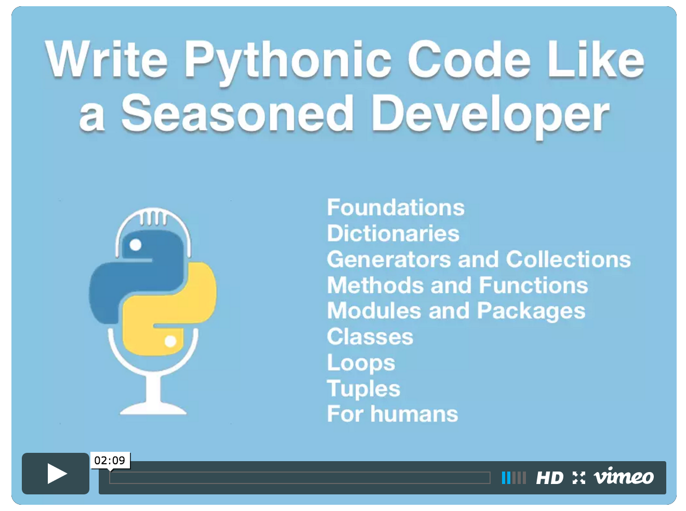

# 10 Tips for Pythonic Code via JetBrains Webcast

This is the accompanying code for my webcast presented by JetBrains and the PyCharm team [*10 Tips for Pythonic Code*](https://blog.jetbrains.com/pycharm/2016/07/webinar-recording-10-tips-for-pythonic-code/).

## Watch the webcast recording

## Webcast summary

One of the special concepts in Python is the idea of writing idiomatic code that is most aligned with the language features and ideals. In Python, we call this idiomatic code Pythonic. While this idea is easy to understand, it turns out to be fairly hard to make concrete. 

In this webcast, Michael Kennedy from the Talk Python To Me podcast will take you on a tour of 10 of the more popular and useful code examples demonstrating examples of Pythonic code. In the examples, you'll first see non-Pythonic code and then the more natural Pythonic version.

Topics covered include the expansive use of dictionaries, hacking Python's memory usage via slots, using generators, comprehensions, and generator expressions, creating subsets of collections via slices (all the way to the database) and more. Several of these are Python 3 features so you'll have even more reason to adopt Python 3 for your next project.

## Go deeper with my Pythonic Code Online Course

Want to go deeper than just a 1 hour webcast? Check out my full, online course covering over 50 Pythonic examples: 

Visit course page: [https://talkpython.fm/pythonic](https://training.talkpython.fm/courses/explore_pythonic_code/write-pythonic-code-like-a-seasoned-developer)
